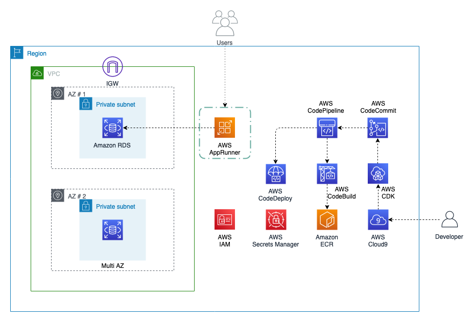
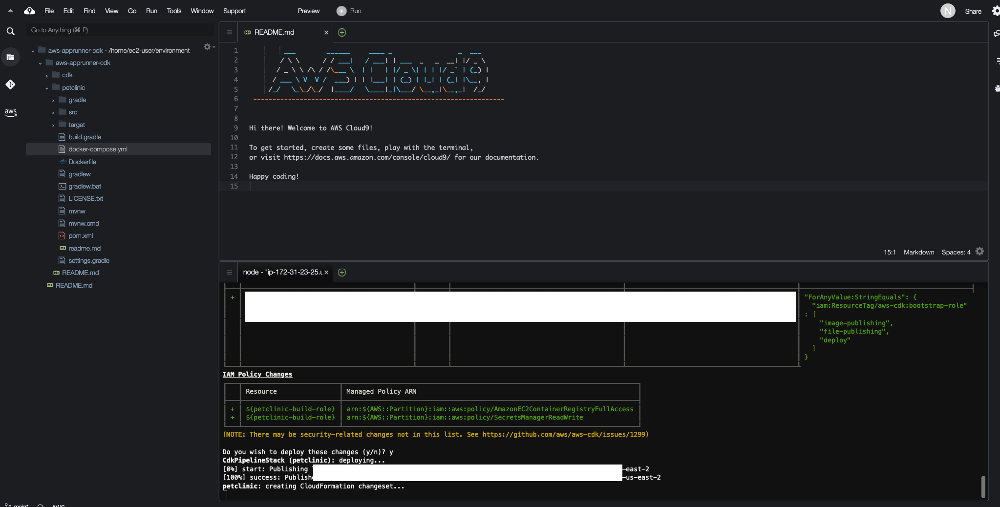

# PythonWebApplicationProject
Web application project in python for coursework 

This is a Python web application which acts as a help desk ticket service. It utilizes django, docker and an assortment of other dependencies which depending on the environment being constructed on will need installation.

Users can register, login and create, read and update tickets they raise for hardware or software issues. 

Only an admin or superuser role has the permissions required to delete a ticket, this is only available on the admin page so that tickets cannot be accessed and deleted by regular users.

There are 4 main status roles for tickets that occur:

- RESOLVED: 
The ticket has been resolved, no further action is required.

- MINOR:
The problem will not lead to any problems in the future, the problem is not critical to basic functionality of an organisation, and the problem can be easily resolved.

- MAJOR: 
The problem can lead to problems down the line that may be major or critical, the problem should be resolved as soon as possible, and can indirectly affect the performance and business organisation status of a team or company.

- CRITICAL: 
The problem is a direct threat to a company or organisation, the problem can lead to complete business failure and must be immediately resolved as soon as possible. 


Users cannot register as admin roles as this role has multiple CRUD privileges, in an industrial real world environment the administrator would be contacted and asked to be granted permissions of an admin or staff role.


It is highly recommended that you create a virtual environment for this project before activating or installing any dependencies, rather than doing system wide installations. 

Your environment will need docker compose if you do not have it already, the installation guide for docker compose can be found here: https://docs.docker.com/compose/install/


**ALL CDK FILES ARE NOT MY OWN, I HAVE ONLY MADE MINOR ADJUSTMENTS NECESSARY TO RUN MY CODE, ALL RIGHTS GO TO THEIR RESPECTIVE OWNERS**

Usage of the AWS pipeline was based upon the AWS petclinic sample which utilises cdk.

cdk petclinic sample and guide can be found here: https://github.com/aws-samples/aws-apprunner-cdk#license

all adjustments made by me were minor and necessary in order to host the python web application


## Build and Deploy Spring PythonWebApplicationProject Application to AWS App Runner using AWS CDK.

## Overview
Leverage AWS services AWS App Runner, Amazon RDS, Amazon Elastic Container Registry, AWS CodePipeline, AWS CodeCommit, AWS CodeBuild, AWS CodeDeploy and AWS CDK to deploy infrastructure as code and build out a CI/CD pipeline. We will use Spring Boot PythonWebApplicationProject application as a sample app to demonstrate the CI/CD pipeline. PythonWebApplicationProject is an MVC application built using Spring framework and leverages a relational database to persist the data.

## Architecture


## Repository Structure
- PythonWebApplicationProject - Spring Boot application code. This is a clone of the spring PythonWebApplicationProject repo. Modification includes addition of the Dockerfile. For more details review the [README](PythonWebApplicationProject/readme.md)
- cdk - AWS CDK Project for Building and Deploying PythonWebApplicationProject App. For more details review the [README](cdk/README.md)

## Configure Development Environment
- Follow the steps in the Cloud9 Environment Setup guide - [Create-Cloud9-Environment](CLOUD9-SETUP.md)

## Environment Setup and Local Testing

1. Setup and Install AWS CDK, Typescript:
    ```bash
    npm install -g typescript
    export CDK_DEFAULT_ACCOUNT="AWS ACCOUNT TO DEPLOY"
    export CDK_DEFAULT_REGION="AWS REGION TO DEPLOY"
    ```

2. Bootstrap AWS CDK:
    ```bash
    cdk bootstrap aws://$CDK_DEFAULT_ACCOUNT/$CDK_DEFAULT_REGION
    ```

3. Clone the source code repository from aws-samples:
    ```bash
    cd ~/environment
    git clone https://github.com/18Tarikjett/PythonWebApplicationProjectVersion2.git
    ```

4. Setup Git User:
    ```
    git config --global user.name "workshop-admin"
    git config --global user.email "workshop-admin@example.com"
    ```

5. Init AWS CDK environment:
    ```
    cd ~/environment/aws-apprunner-cdk/cdk
    npm install @types/node
    ```

6. Run PythonWebApplicationProject application locally and run the following inside the Cloud9 terminal:
    ```bash
    cd ~/environment/aws-apprunner-cdk/PythonWebApplicationProject
    docker compose up
    ```

    Press Ctrl+C to stop the running application.


## Build the infrastructure and pipeline using AWS CDK and validate the application and pipeline.

**Note:** This workshop will create chargeable resources in your account. When finished, please make sure you clean up resources as instructed at the end.

1. Set up DockerHub Credentials in Secrets Manager for Docker Login credentials. Please provide your personal docker username (not email) and password. Note this step demonstrates the use of Docker Hub and provides an example on how to leverage the private registries to be included in the pipeline using Secrets Manager. 
    ```bash
    cd ~/environment/aws-apprunner-cdk
    aws secretsmanager create-secret \
        --name dockerhub_credentials \
        --description "DockerHub Credentials" \
        --secret-string "{\"username\":\"dockerhub_username\",\"password\":\"dockerhub_password\"}" \
        --region=$CDK_DEFAULT_REGION
    ```
2.    Set up DockerHub Credentials in Secrets Manager for Docker Login credentials. Please provide your personal docker username (not email) and password. Note this step demonstrates the use of Docker Hub and provides an example on how to leverage the private registries to be included in the pipeline using Secrets Manager. 
        ```bash
        cd ~/environment/aws-apprunner-cdk
        aws secretsmanager create-secret \
            --name django_superuser_password \
            --description "Django super user password" \
            --secret-string "superuser_password" \ 
            --region=$CDK_DEFAULT_REGION

3. Deploy Step Phase 1: Create Code Commit Repo
    - Setup the Code Commit Repo. 
        ```bash
        cd ~/environment/aws-apprunner-cdk/cdk
        cdk deploy
        ```
    - When asked whether you want to proceed with the actions, enter `y`.
        
    - Wait for AWS CDK to complete the deployment before proceeding. It will take few minutes to complete “cdk deploy”. Pipeline will fail since the code is not available in code commit repo.

4. Deploy Step Phase 2: Enable CI/CD Pipeline and deploy infrastructure and application.
    - Commit the code and set the origin to the code commit repo that was created.
        ```bash
        cd ~/environment/aws-apprunner-cdk
        git remote rename origin upstream
        git remote add origin "provide codecommit repo HTTPS URL created in above step"
        git push origin main
        ```
    - Code Commit changes will invoke the Code Pipeline. It will take approximately 20 to 30 minutes to complete the deployment.
    - Initial deployment will take longer since this includes building the container image for the application and setting up the infrastructure that includes Networking, RDS and other dependent components.
    - Explore the deployment progress on the CloudFormation console.

5. Validate the Deployment.
    - Once the deploy is complete, you can review the repo in App Runner service using the AWS console. 
    - View the App Runner service using the [AWS App Runner console](https://console.aws.amazon.com/apprunner/)

6. Review the deployed stack.
    - View the RDS database using the [Amazon RDS console](https://console.aws.amazon.com/rds).
    - View the ECR repo using the [Amazon ECR console](https://console.aws.amazon.com/ecr).
    - View the CodeCommit repo using the [AWS CodeCommit console](https://console.aws.amazon.com/codecommit).
    - View the CodeBuild project using the [AWS CodeBuild console](https://console.aws.amazon.com/codebuild).
    - View the CodePipeline using the [AWS CodePipeline console](https://console.aws.amazon.com/codepipeline).

7. Validate the CI/CD Pipeline.
    - Make a source code change in the PythonWebApplicationProject application. Make the change to messages.properties under `PythonWebApplicationProject/src/main/resources/messages/messages.properties`. Change the welcome value to `Welcome to CI/CD using AWS CDK`.
    - Commit the change and push the change to the code commit repo.
        ```bash
        cd ~/environment/aws-apprunner-cdk
        git commit -am "updated the title"
        git push origin main
        ```
    - Review that the commit started the code pipeline build. It will take approximately 10 minutes to deploy the change which includes building a new image and deploying the latest version to AWS AppRunner.
    - Once the deploy is complete, you can refresh the application home page and you should see the change reflected on the home page.

8. Cleaning Up.
    - Delete the AWS CDK stack.
        ```
        cd ~/environment/aws-apprunner-cdk/cdk
        cdk destroy
        ```
    - When asked whether you want to proceed with the actions, enter `y`. Wait for AWS CDK to complete the destroy.
    - Delete the AWS CloudFormation `PythonWebApplicationProject-deploy-*` stack from the AWS CloudFormation Console.
    - Delete the images in the AWS ECR `PythonWebApplicationProject` repo.
    - Delete the AWS CloudFormation `PythonWebApplicationProject-build-*` stack from the AWS CloudFormation Console.
    - Delete the AWS Cloud9 `workshop-environment` environment including the `workshop-admin` IAM role.
    - Delete the `dockerhub_credentials` from AWS Secrets Manager.

## Security

See [CONTRIBUTING](CONTRIBUTING.md#security-issue-notifications) for more information.

## License

This library is licensed under the MIT-0 License. See the LICENSE file.

